### Programming Language Concepts

### Values and Symbols
Symbols are variables, names that can be given to entities. *A symbol refers to a value. A value can be referred by many
symbols*. A value is stored in memory, symbol is a reference to that stored memory location. Multiple symbols can reference
one value. Changing the value will affect all symbols referencing that value.
### Immutability
When your language does not have features of changing the value itself. (Mostly to help against bug introduced by mutability)
Some languages will allow you to assign new value to an existing symbol but without overwriting the actual value, so just a new memory location and it will bind your variable to that new location.
In Java,
- Passing a primitive into function -> `passes value itself`
- Passing an object to a function -> `passes reference to the object`
### Types
- Primitive Types: integers, characters, strings, floats etc
- Complex Data Types: Arrays, Maps, Lists, Sets, Maps (Dictionaries, hashes, Associative Arrays) etcetera
### Bindings
```python
# n inside function is different from n variable which is being assigned a value of 1.
n = 1
def testAddition(n):
    return n+1
```
Binding of n is different inside function from outside. Definition of a parameter in a function creates a new binding, introducing new bindings -> **Scope**
### Typing
Type System: Different types of data can be distinguished from another i.e values of type string and values of type integer.

| Statically Typed languages  | Dynamically Typed languages |
| ------------- | ------------- |
| Type is bound to symbol  | Type is bound to value  |

#### Static typing
Type of data that a symbol refers to is known at compile time. You will have to declare the type of variable. e.g C, Java.

#### Type Inference
If a language lets you get away with not declaring types because the compiler is smart enough to figure out what type the symbol must have been. e.g. Haskell, Scala.

Note: These languages are still statically typed as types are still bound to symbols not values.

##### Pros/Cons
- Type safety, compiler can check errors in type handling.
- Early recognition of errors.
- Optimization of compiled code, compiler knows the types and can apply optimizations for the data types.
- Code is very verbose (symbol types, function params, custom types to hold data) also if your code is handling type A, it will need changes to support type B or use advanced language features to support multiple types flexibly.

#### Dynamic Typing
Type of data that a symbol refers to is only known at runtime. Symbols are free of types and can refer to any type so you will not see in type declarations, e.g. PHP, JavaScript, Perl

##### Pros/Cons
- No type safety at compile time.
- Types only become clear at runtime.
- Fewer optimizations from compiler since types are unknown.
- Less verbose code.
- No need for type declarations, and no need for definitions.
- You can use language's native collection types rather than build your own.
- Life will become difficult if you write functions that accept many different “shapes” of data structures.
- You can write a function and apply it to data without being forced to define custom data types for your use case.

#### Type Hints
You can annotate symbols with type declarations, so that the compiler can act on that regarding its optimization. 
This can be very beneficial for performance critical sections of your code and can often result in very fast object code, 
that is just as fast as code compiled from a statically typed language. (Common Lisp and Clojure)

#### Strong Typing
Strong typing means that the language is quite restrictive about casting data of one type to another. Some type safety check is in place.  Java for example is a strongly typed language and thus does not allow a Double to be cast to an Integer. Instead, the language usually provides functions that will convert one type to another type.

#### Weak typing
Weak typing means that the language is not restrictive about casting data of one type to another. e.g. C

### Lifetime stages a program runs through
Source code -> Preprocessor -> Compiler -> Runtime

### Compile Time vs Runtime

#### Compile Time
- Source code is being transformed into machine code, bytecode or source for a different language
- Compilation usually consists of multiple stages e.g optimization

#### Runtime
- Code runs natively on virtual machine. Garbage collection, dynamic typing etc happen here.

#### Just in time compilation (JIT)
While running an interpreted program, runtime may call the compilation stage whenever code is to be run that has not yet been compiled. This can happen quite a lot depending on the interpreter being used.

### Mutable State
When the state of a program changes over time, it is said to have Mutable state. This makes code unmanageable
and error prone. It should be avoided if possible however if we want to introduce it somwhere in code, it should
not impact other parts of the code. e.g When the user moves the mouse for example, it is in fact a change in state of the external world.

### Recursion and Iteration
- Every iterative implementation can be converted to a recursive one and vice versa.
- Recursion may lead to a stack overflow, as each nested recursive call consumes space
on the stack.
- Iterative programs usually rely on mutable state, as you have to make use of a
variable that counts the iterations or something similar

```python
def sum(list):
    sum = 0
 
    # Add every number in the list.
    for i in range(0, len(list)):
        sum = sum + list[i]
 
    # Return the sum.
    return sum
 
print(sum([5,7,3,8,10]))
```
```python
 To do this recursively:

#!/usr/bin/env python
 
def sum(list):
   if len(list) == 1:
        return list[0]
   else:
        return list[0] + sum(list[1:])
 
print(sum([5,7,3,8,10]))
```
If the length of the list is one it returns the list (the termination condition).

### Statements vs Expressions
- Statements don't evaluate to a value.
- Expressions evaluate to something, i.e a + b is an expression
- In functional languages everything is an expression,
a function definition evaluates to a function object that
can be passed around afterwards.

In Clojure for example if evaluates to to then or else branch

```ruby
def fn(x,y)
  y * if x > 10.0
         0.1
      else
         1.0
      end
end

printf(“%.2f\n”, fn(8.0, 123.4))
printf(“%.2f\n”, fn(11.1, 123.4))
```

Many languages support ternary operator, (? :) but that is mainly syntactic sugar - languages in which everything is an expression do not need such special operators and have conciseness in mind.

### Paradigms



### Imperative Languages
Examples: C, Java
- How you want to do something
- Relying on mutable state is common
- Declaration and definition of variables and
then alter values
- Favors Iteration

### Declarative languages
Examples: Haskell

- It will not describe how you want to do something
- It will describe what we want to receive as a result
- How dependencies between entities are
- Mostly includes functional programming languages
- Favors recursion (this makes it possible to avoid
mutable state which is desirable)

```haskell
fact n
   | n > 1 = n * fact (n - 1)
   | otherwise = 1
main = print (fact 5)
```

Here in Haskell, we just say that the factorial of n is the product of n and the factorial of n-1 , for an n that is greater than 1 . For n not greater than 1 , the factorial is just 1 .

Prolog code shows expression more in the problem domain instead of having to translate it into something more
mechanical,

```prolog
factorial(0,1). /* factorial of 0 is 1. */
factorial(N,F) :- /* factorial of N is F if...*/
    N > 0, /* N is greater than 0 and...*/
    N1 is N - 1, /* N1 is equal to N-1 and...*/
    factorial(N1,F1), /* factorial of N1 is F1 and...*/
    F is F1 * N. /* F equals F1 * N. */
```

People usually chose Imperative style over Declarative programming because of the ease of not writing in Abstractions
that confuse the reader and using a smaller memory footprint, in modern times machines are not facing constraints that
would make declarative programming languages slower than imperative style languages.

You can do both imperative and declarative program development in one language,

```ruby
The declarative version:
def fact(n)
     (n > 1) ? n * fact(n - 1) : 1
end

printf “fact of 5 is %d\n”, fact(5)

And here the same algorithm, expressed in a more imperative style:

def fact(n)
   result = 1
   while n > 0 do
        result = result * n
        n -= 1
   end
   result
end

printf “factorial of 5 is %d\n”, fact(5)
```
#### Switching between them
- Parts of the programming dealing with I/O should use imperative style.
- Performance critical parts of a program should use imperative style
- Declarative style is better than imperative style for its conciseness



### Scope

Scope refers to the “parts” of a program in which a variable or binding is visible / accessible. A global symbol for example is usually visible throughout the entire source code while a local symbol is only visible within the function or block where it has been created.

### Free Variables

```
d = 5

def x(a, b) {
   c = 3;
   return a + b + c + d;
}

def y() {
   d = 10;
   return x(1, 2);
}
```

- function x takes two params a and b
- defines a local variable c
- a , b or c are bound locally
- access to variable d in the function is not as obvious
- variable d is a free variable

So which one should be consider d's value, 5? or 10?

### Lexical scope

First definition of d so 5

### Dynamic scope
Check out the call stack so 10. That is the value after which we make a call to x.

#### Issues:
- Runtime analysis of call stack.
- Makes debugging hard.

#### Advantages:
The benefit of dynamic variables is that you can change their binding locally, meaning that for the very function you are about to call you can “install” a different binding into the dynamic variable than for the rest of the program. That is usually accomplished by a statement called let or binding

```clojure
An example in Clojure shows this principle:
;; first, define our available “logger” functions:
(defn file-logger [msg]
   (println (str “FILE: ” msg)))

(defn console-logger [msg]
   (println (str “DB: ” msg)))

;; define and initialize a dynamically scoped symbol:
(def ^:dynamic logger file-logger)

;; we log via this function:
(defn log [msg]
     (logger msg))
;; and here is the example that temporarily rebinds the dynamic symbol:
(defn log-some []
    (log “logging to file logger”)
    (binding [logger console-logger]
      (log “logging to console logger”)
      (log “still logging to console logger”))
    (log “logging to file logger again”))

;; call it:
(log-some)
```

When running this, it will print:
FILE: logging to file logger
DB: logging to console logger
DB: still logging to console logger
FILE: logging to file logger again

So this saves you from passing the appropriate logger to each and every function. This has no impact on threads as this is not hijacking the global scope instead it is just shadowing the global value for the block of code that it embraces.

### Tail Recursion
A recursive program might crash when recursive function calls itself too often in a nested way because there is only a limited space available in the call stack. With each nested call, the stack fills up a bit. Once it is full and another call is being made, the program crashes or throws an exception.

The stack is responsible for keeping track of the point of return when a function exits. The call stack often also holds the arguments passed to a function call and any local variables a function declares. So when a recursion “calls too deep”, the stack will run out of space

#### Errors raised:
- Segmentation in C
- StackOverflowException Java

“A recursive call is said to be tail recursive when its result is not involved in any further processing of the caller.” “A recursive call is tail recursive when its caller does not need to wait for the result in order to do more things to it.”“A recursive call is tail recursive when it is the last thing the caller does before returning.”

A recursive call that sits in a tail position can be replaced by a simple “goto”, which - contrary to a function call - does not consume space on the stack. This is possible because due to the tail position of the call, the caller does not even have to take a look at the result of that function call. So returning to that caller is just waste and can be skipped.

```python
def factorial(n):
  if n == 0: return 1
  else: return factorial(n-1) * n

def tail_factorial(n, accumulator=1):
  if n == 0: return 1
  else: return tail_factorial(n-1, accumulator * n)
```

They both look similar, and in fact the original even looks like it's in the tail call form, but since there's that pesky multiplication which is outside of the recursive call it can't be optimized away. In the non-tail version the computer needs to keep track of the number you're going to multiply it with, whereas in the tail-call version the computer can realize that the only work left to do is another function call and it can forget about all of the variables and state used in the current function

This is all great, but there's a problem with that example, namely that python doesn't support tail-call optimization. There's a few reasons for this, the simplest of which is just that python is built more around the idea of iteration than recursion.

### Tail Call Optimization
Compilers for languages that feature recursive programming style often offer a feature called Tail Call Optimization (often abbreviated TCO). The compiler understands when a call is a tail call and will then produce object code that does not consume any stack space, effectively resolving the risk of a potential stack overflow, no matter how deep the nested calls will get. e.g Haskell, Scheme, JVM does not support TCO natively

A common pattern is to introduce a so called “accumulator” variable that is being passed into the function.

More tail recursion links

- http://markmiyashita.com/cs61a/tail_recursion/tail_recursion_and_tail_optimized_calls/
- http://paulbutler.org/archives/tail-recursion-in-python/
- http://disq.us/url?url=http%3A%2F%2Fwww.gabriel.urdhr.fr%2F2018%2F03%2F19%2Fsibling-tco-in-python%2F%3AL62UknXluZmwSI5K0CMjASx4TWg&cuid=3437142

### Advanced Concepts

These concepts are not necessarily part of all programming languages but their usage makes code concise, abstract and less error prone. This knowledge will also help choosing a language for a task.

Additionally, thinking outside the box and seeing the bigger picture can only be beneficial for ones awareness of 
what the “programming language world” looks like

### First Class Functions (Higher
Order Functions)

If a language supports them then you can pass them around like data in your program.

```javascript
// Defining two functions and
// binding them to variables
var add = function(a, b) {
    return a + b;
}
var sub = function(a, b) {
    return a - b;
}
// Test expects a function to be passed
function test(f) {
    console.log(“about to call f...”);
    var fresult = f();
    console.log(“done calling f: ” + fresult);
}
// Calling functions via their bindings
var functions = [ add, 123, sub ];
console.log(functions[0](11, 22));
console.log(functions[2](22, 11));

// We define function right at the spot.
// Anonymous or lambda
test(function() {
    return 123;
});
```

#### Simple Python example

```python 
def multiply(x, y):
    return x * y
```
can be expressed, as 
```python 
r = lambda x, y: x * y
r(12, 3)   # call the lambda function
```
Here we are using two arguments x  and y , expression after colon is the body of the lambda function. As you can see lambda function has no name and is called through the variable it is assigned to.
You don’t need to assign lambda function to a variable.

```python
(lambda x, y: x * y)(3,4)
1
(lambda x, y: x * y)(3,4)
Expected Output:
12
```
Note that lambda function can’t contain more than one expression.
